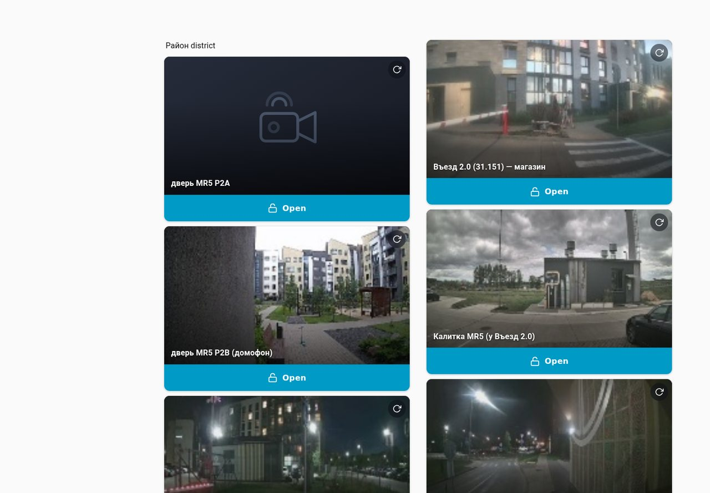
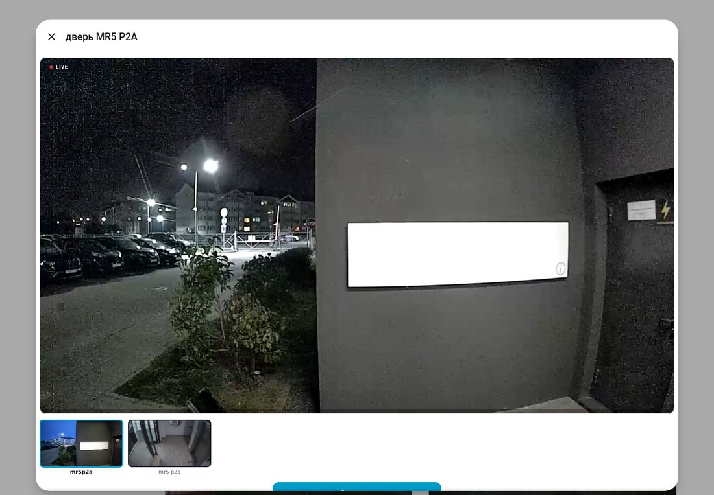
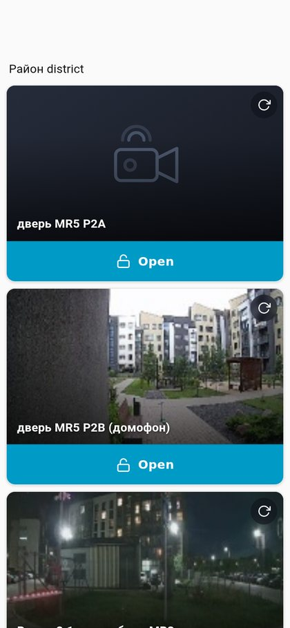

# HikCentral District — Home Assistant Integration

A **Home Assistant custom integration** (HACS-compatible) for HikCentral Pro (Bumblebee API v2.x). Controls door locks, monitors door contact sensors, displays camera streams, and exposes system diagnostics for a HikCentral-based access control system.

## Screenshots

| Desktop — two-column district board | Live popup with the Open button |
|---|---|
| [](docs/district-desktop.jpg) | [](docs/district-popup.jpg) |

Mobile collapses to a single column natively: [](docs/district-mobile.jpg)

## Features

- **Door Locks** — Lock/unlock/open, remain locked/unlocked per door (actions 1–4 via raw HTTP PUT)
- **Door Contact Binary Sensors** — magnet state per door (open/closed)
- **Online Status Binary Sensors** — per-door online/offline monitoring
- **Camera Entities** — live snapshots via the Authenty protocol (real current frame from the VTDU, no direct camera access needed); HikCentral thumbnail as fallback
- **Live Video (optional)** — RTSP bridge script (`rtsp_bridge.py`) for the bundled go2rtc, giving on-demand live streams in Lovelace
- **System Diagnostics Sensors** — online controller count, total doors, total cameras
- **Door Action Service** — `hikcentral_district.door_action` with `door_id` + `action` fields
- **Snapshot Refresh Service** — `hikcentral_district.refresh_snapshot`: fresh JPEG (Authenty → thumbnail → ffmpeg) written atomically to `www/snapshots/`
- **Intercom Card** — `custom:district-intercom-card` Lovelace card (snapshot cover + refresh, full-width Open, live popup with view switching) — shipped inside the integration, see [Intercom Card](#intercom-card-district-intercom-card)
- **Config Flow** — URL, username, password, SSL toggle, scan interval (10–300 s)
- **Options Flow** — multi-select which doors and cameras to expose + `extra_door_ids`

## Requirements

- Python 3.11+
- [hikcentral_bumblebee](https://github.com/megastruktur/hikcentral-bumblebee) ≥ 0.3.0
- `ffmpeg` in the Home Assistant container (stock images include it) — for live snapshots
- Home Assistant 2024.11+
- Network access to HikCentral Pro server

## Installation

### Via HACS (recommended)

1. Add this repository as a **custom repository** in HACS:
   - HACS → Integrations → ⋮ → Custom repositories
   - URL: `https://github.com/megastruktur/hikcentral-district`
   - Category: Integration
2. Click **Explore & Add** → search for **HikCentral District** → Install

### Manual

Copy `custom_components/hikcentral_district/` into your Home Assistant's
`custom_components/` folder.

### One command: integration + browser_mod + dashboard (no HACS UI)

`install.sh` sets up the whole "district" experience in an existing HA config
directory — the integration from this checkout, **browser_mod v3.2.1** (popup
dependency, installed straight from the GitHub zipball), the **district
dashboard** (`.storage/lovelace.district` + dashboard entry +
`/browser_mod.js` and `/local/district/district-intercom-card.js?v=<version>`
resources), and a **one-time snapshot seed** (`scripts/refresh_district_snapshots.py`
copied into `<config>/scripts/` and run once, best-effort):

```bash
git clone https://github.com/megastruktur/hikcentral-district
cd hikcentral-district

# dry run first — reports everything, changes nothing:
./install.sh --config /path/to/ha/config --check

# real run (seeds the integration config entry from these env vars):
HIK_URL=https://your-hikcentral:443 HIK_USER=you HIK_PASS='secret' \
  ./install.sh --config /path/to/ha/config --yes
```

Then **restart Home Assistant** and open `<ha>/district`. Without `HIK_*`
env vars the config entry is not seeded — configure it via the UI instead
(Settings → Devices → Add Integration → *HikCentral District*).

Notes:

- Everything is idempotent — re-running only fills in what is missing.
- `.storage` edits are **merge-only**: existing config entries, resources and
  dashboards are never modified or dropped.
- If popups do not open, enable **Register** once in the Browser Mod panel.
- `--stage-only` writes the artifacts to `<config>/.install-staging/` for
  manual review instead of applying them.
- `--update-components` is required before the script will replace an
  already-installed component whose version differs (HACS owns updates
  otherwise).

### Full stack from scratch (docker host, incl. the rtc sidecar)

Everything below lives in this repo: `install.sh` (integration +
browser_mod + dashboard into an HA config dir), `deploy/` (compose with
Home Assistant + the **go2rtc-hik** RTSP sidecar), and the generators
(`dashboards/autodiscover.py`, `deploy/generate_go2rtc.py`,
`dashboards/generate_district.py`). HikCentral Pro servers older than
V3 (verified on V1.7) have **no server-side CCTV↔door links** — the
doorbell channel is the only "related" camera, so the flow below starts
from doorbell channels and lets you add CCTV angles afterwards.

> **HACS-first variant**: install the integration and browser_mod via
> HACS *before* step 4 (integration → custom repository, browser_mod →
> Frontend). `install.sh` never replaces already-installed components
> (that needs `--update-components`), so in that setup it only stages
> the dashboard, resources and the snapshot seed while HACS keeps
> owning the code.

```bash
# 1. clone + prepare the config dir and credentials
git clone https://github.com/megastruktur/hikcentral-district
cd hikcentral-district
mkdir -p config
cat > .env <<'EOF'
HIK_URL=https://your-hikcentral:443
HIK_USER=you
HIK_PASS=secret
EOF
chmod 600 .env

# 2. cameras.json: door map + AUTO-DISCOVERED doorbell channels (first view)
cp dashboards/cameras.example.json dashboards/cameras.json
$EDITOR dashboards/cameras.json        # fill "doors": {"lock.x": "<door_id>"} …
set -a; . ./.env; set +a
python3 dashboards/autodiscover.py --write   # dry-run without --write

# 3. generate the go2rtc sidecar config from the same cameras.json
python3 deploy/generate_go2rtc.py deploy/go2rtc-hik/go2rtc.yaml

# 4. install integration + browser_mod + dashboard skeleton into ./config
./install.sh --config ./config --check          # dry run first
HIK_URL=$HIK_URL HIK_USER=$HIK_USER HIK_PASS=$HIK_PASS \
  ./install.sh --config ./config --yes          # seeds the config entry too

# 5. start the stack: HA + go2rtc-hik (exec bridge bind-mounted from the
#    integration dir — that is why step 4 runs BEFORE compose up)
docker compose -f deploy/docker-compose.example.yaml up -d --build
```

Finish in the HA UI:

1. Onboarding (fresh installs), then Settings → Devices → **HikCentral
   District** (pre-seeded by step 4; otherwise add it with URL/user/pass).
2. **Options** of the integration: *Stream URL Template* =
   `rtsp://127.0.0.1:18556/hik_cam_{id}`; *Stream Cameras* = the camera
   ids from your `cameras.json` (the go2rtc stream set); select the
   doorbell cameras in *Selected Cameras* (they appear with the
   «(интерком)» suffix — discovered from door stations since v0.6.7).
3. Open `<ha>/district` — snapshot covers, live popups, Open buttons.
   If popups do not open, toggle **Register** once in the Browser Mod panel.

Snapshot covers: each card has a refresh button. For periodic refresh,
add the script + an automation on your host (what our prod uses):

```yaml
# configuration.yaml
shell_command:
  refresh_district_snapshots: python3 /config/scripts/refresh_district_snapshots.py
# automations.yaml (every 10 minutes; script reads dashboards/cameras.json
# copied next to it, creds from the integration's config entry)
- id: district_snapshots_refresh
  alias: district_snapshots_refresh
  trigger: [{ platform: time_pattern, minutes: /10 }]
  action: [{ service: shell_command.refresh_district_snapshots, data: {} }]
  mode: single
```

Updating later: HACS (or `git pull` + `./install.sh --config ./config
--yes --update-components`), re-run steps 2–3 when cameras change, and
`docker compose -f deploy/docker-compose.example.yaml up -d --build` to
rebuild the sidecar (go2rtc reads its config **at container start only**).

Details: `dashboards/README.md` (cards, cameras.json schema, generators),
`deploy/go2rtc-hik/go2rtc.yaml` comments (H.264 direct vs H.265 wrapper),
[Live Video](#live-video-optional) (exec-source contract + allowlist).

### HAOS / Supervised users: the RTC sidecar as an add-on

The compose flow above needs a docker host. On **HAOS / Home Assistant
Supervised** there is no `docker compose` — install the same go2rtc-hik
sidecar as an add-on instead:
[megastruktur/ha-addons-hikcentral](https://github.com/megastruktur/ha-addons-hikcentral)
(Settings → Add-ons → Add repository). Order still matters: **integration
first** (HACS — the add-on exec-mounts `rtsp_bridge.py` from
`/config/custom_components/hikcentral_district`), then configure the add-on
with the same HIK credentials and the camera ids from your
`cameras.json` / `autodiscover.py`. Ports are identical to compose
(`127.0.0.1:18556` RTSP, `:1984` API), so *Stream URL Template* and the
allowlist are set exactly as in step 2 above. Core/container installs keep
using the compose sidecar.

## Configuration

### Config Flow (UI)

| Field | Default | Description |
|---|---|---|
| URL | `https://86.57.210.56:443` | HikCentral Pro base URL |
| Username | — | HikCentral user |
| Password | — | HikCentral password |
| Verify SSL | `false` | Toggle SSL certificate verification |
| Scan Interval | `30` | Polling interval in seconds (10–300) |

### Options Flow

| Field | Description |
|---|---|
| Selected Doors | Multi-select which doors to create entities for |
| Selected Cameras | Multi-select which cameras to create entities for |
| Extra Door IDs | Comma-separated HikCentral door IDs to fetch directly by ID (doors the list call does not return — see [Door Discovery](#door-discovery)) |
| Live Snapshots | Fetch real current frames via the Authenty protocol (default on) |
| Stream URL Template | go2rtc URL with `{id}` placeholder for live views (see [Live Video](#live-video-optional)) |
| Stream Cameras | Allowlist of camera ids that advertise live streaming (empty = all; keep it equal to your go2rtc.yaml stream set — see [Live Video](#live-video-optional)) |

## Door Discovery

On every poll cycle the coordinator discovers doors in two ways and merges them
(deduplicated by door ID):

1. **List discovery** — `POST /ISAPI/Bumblebee/ACS/DoorElements` enumerates the
   doors visible to the account; full per-door status is then fetched for each.
2. **Extra door IDs** — the `extra_door_ids` option (integration **Options**,
   comma-separated) is fetched directly by ID and merged into the result.

Extra IDs are needed when doors exist on the HikCentral server but the
account's list call does **not** return them. A direct
`GET /ISAPI/Bumblebee/ACS/DoorElements/{id}` still works for each. Example —
the district this repo was built for (verified live 2026-08-15/17):

| Extra Door ID | Name |
|---|---|
| 999 | Vyezd2.1 (barrier) |
| 1002 | Vyezd2.2 (barrier) |
| 1007 | Kalitka_MR1-2 |
| 536 | дверь_MR5 P2A |
| 538 | дверь_MR5 P2B |
| 1004 | Kalitka_1.6 |
| 1290 | Kalitka MR5 |
| 1396 | Vyezd2.3 (30.18) |
| 1397 | Vezd2.0 (31.151) |

Set them in Settings → Devices → HikCentral District → Configure (the entry
reloads and the extra lock/binary-sensor entities appear). A failed fetch of an
extra door is logged as a warning and skipped; it never breaks the update cycle.

## Entity Types

| Platform | Entity | Description |
|---|---|---|
| `lock` | `Door Lock (<name>)` | Lock control per door. State from `DoorStatus.LockState` (0=locked, 1=unlocked, other=unknown). Services: lock, unlock, open |
| `binary_sensor` | `<name> Door Contact` | Door contact magnet state (0=closed=off, 1=open=on) |
| `binary_sensor` | `<name> Online` | Door online/offline status |
| `camera` | `<name>` | Snapshot: live Authenty frame → HikCentral thumbnail → ffmpeg RTSP fallback. Live view: see [Live Video](#live-video-optional) |
| `sensor` | `HikCentral System` | Online controller count, total doors/cameras |

## Door Status Semantics

Each door reports a `DoorStatus` block; the fields below are also exposed as
state attributes on the lock entity:

| Field | Meaning |
|---|---|
| `MagnetState` | Door-contact magnet state (0=closed, 1=open) |
| `LockState` | 0 = locked, 1 = unlocked (any other value → unknown) |
| `PolicyState` | Access-policy state reported by the controller |
| `OverallStatus` | Aggregate door status reported by the controller |

## Services

### `hikcentral_district.door_action`

Send a control action to a specific door.

```yaml
service: hikcentral_district.door_action
data:
  door_id: "996"   # Door element ID
  action: 1        # 1=unlock/open, 2=lock, 3=remain unlocked, 4=remain locked
```

### `hikcentral_district.refresh_snapshot`

Fetch a fresh snapshot for a camera entity and store it as a static file for
dashboard covers. Chain: live Authenty frame → HikCentral thumbnail → ffmpeg
RTSP fallback. The JPEG is written atomically (tmp + rename) to
`<config>/www/snapshots/<filename>` (served as `/local/snapshots/<filename>`),
the camera entity's cached image is updated, and its `last_snapshot` attribute
is bumped (ISO-8601 UTC). On failure the service raises an error and no file
is written.

```yaml
service: hikcentral_district.refresh_snapshot
data:
  entity_id: camera.mr5_p2a   # target camera entity
  filename: mr5-p2a.jpg       # optional; default = entity_id without domain + .jpg
```

## Door Actions

Door control is sent as a raw HTTP PUT:

```
PUT /ISAPI/Bumblebee/ACS/DoorElements/{DoorID}/DoorAction?SID=<sid>
```

| Action | Meaning |
|---|---|
| 1 | Open / unlock |
| 2 | Lock |
| 3 | Remain unlocked |
| 4 | Remain locked |

These actions are exposed both through the lock entities (`open`, `lock`,
`unlock` — where `open` and `unlock` both send action 1) and through the
`hikcentral_district.door_action` service.

## Protocol Notes

- Authentication: plain-password XML login → AES key derivation (MD5^100(password + challenge))
- Each request: `AppendInfo` = AES-CBC base64 signature
- Door actions use **raw HTTP PUT** to `/ISAPI/Bumblebee/ACS/DoorElements/{id}/DoorAction?SID=<sid>` (no `MT=` parameter)
- Door status polled via `GET /ISAPI/Bumblebee/ACS/DoorElements/{id}`
- **Live streams**: `CommonUrl` → RTSP `Authenty` handshake (SEP DATA / Key / Identification headers,
  AES-256-CBC with challenge-mixed key) → RTP H.264, depacketized to Annex-B (see
  `hikcentral_bumblebee.streaming` docstring for the full reverse-engineered protocol)

## Live Video (optional)

Snapshots work out of the box (options → **live_snapshots** on by default).
Live streams in Lovelace need a **standalone go2rtc** — HA 2026.6 bundles
only a go2rtc *client* and rejects `streams:`/`rtsp:` keys in its
`go2rtc:` YAML.

go2rtc exec-source contract (all three matter):

1. the bridge must write **raw Annex-B H.264 to stdout** (no ffmpeg RTSP
   mux) — this is what `rtsp_bridge.py` does since v0.5.2;
2. the stream must **start at an SPS** — the bridge skips forward to the
   next SPS on every (re)connect (go2rtc's magic probe rejects any other
   first NAL);
3. source list items must be **quoted strings, single-line**:

```yaml
# standalone go2rtc.yaml
rtsp:
  listen: "127.0.0.1:18556"   # 18554 is HA-managed go2rtc; pick a free port
api:
  listen: "127.0.0.1:1984"
streams:
  hik_cam_240:
    - "exec: python3 /app/bridge/rtsp_bridge.py --host https://YOUR-HCP --username USER --password PASS --camera 240 --insecure"
```

`- exec: python3 …` (map form) is **silently dropped** by go2rtc — the
stream shows up with zero producers (`streams: unknown error`).

Then set *stream URL template* in the integration **Options** to
`rtsp://127.0.0.1:18556/hik_cam_{id}` — every camera entity gets a
working `stream_source` and Lovelace camera dialogs play live video.
go2rtc starts the bridge per viewer and stops it on disconnect (stream
on demand).

### stream_camera_ids (allowlist) — v0.6.7

The template applies to **every** camera entity, but go2rtc only carries
the streams you configured. Any live view of an unconfigured camera then
starts a stream worker that 404s against go2rtc forever (log flood,
"unavailable" camera dialogs). Since v0.6.7 the **Options** form has a
*stream cameras* multi-select: only the selected camera ids advertise
the STREAM feature (empty = all, the old behavior). Set it to exactly
the ids that have a `hik_cam_<id>` stream in go2rtc.yaml.

### Door-station (intercom) cameras — v0.6.7

HikCentral door stations have built-in cameras that
`get_camera_elements()` **never returns** — they are only referenced
inside the per-intercom detail (`ACS/Device/VideoIntercoms/<id>` →
`DoorList` + `CameraList`; the same source the mobile app uses). Since
v0.6.7 the camera platform discovers them at setup
(`hikcentral_bumblebee.get_video_intercom`, library ≥ commit `cdbcc46`)
and creates regular camera entities — doorbell icon, always "on",
streamed through the same `hik_cam_<element_id>` go2rtc URL and the
same Authenty snapshot path. Enable them via *selected cameras* in
**Options** and add matching exec streams to go2rtc.yaml
(`deploy/generate_go2rtc.py` handles them like any other camera).

A ready-to-deploy go2rtc sidecar (Dockerfile + go2rtc.yaml + compose
service) lives in the megaserver `platform/homeassistant/` stack.

Bridge modes:

```bash
# raw H.264 on stdout (for go2rtc exec:) — default mode
rtsp_bridge.py --host … --camera 240

# one-shot JPEG to stdout ( handy for cron/scripts )
rtsp_bridge.py --host … --camera 240 --jpeg 3 > frame.jpg

# raw H.264 append to file (debug)
rtsp_bridge.py --host … --camera 240 --h264 /tmp/cam.h264
```

## Intercom Card (district-intercom-card)

Since v0.6.0 the integration ships a Lovelace card for door-entry dashboards:
`custom_components/hikcentral_district/frontend/district-intercom-card.js`.
At every setup the integration idempotently syncs it to
`<config>/www/district/district-intercom-card.js`, so a HACS update + HA
restart updates the Python part **and** the card together. One vanilla web
component file, no build step, no dependencies; includes a visual config
editor (`getConfigElement`).

Register the Lovelace resource **once** (install.sh does this; or manually
Settings → Dashboards → Resources):

```
URL:  /local/district/district-intercom-card.js?v=0.6.0
Type: JavaScript Module
```

The `?v=<version>` suffix busts the browser cache; bump it when the card
changes.

### Card config reference

Views are configured **explicitly in the card config** — the card fetches
nothing and hardcodes nothing.

```yaml
type: custom:district-intercom-card
entity: lock.vyezd2_1                    # door lock entity; OR device: <device_id>
views:                                   # any number of camera entities
  - camera.mr3_30_93_vyesd_2_1
  - camera.mr3_30_95_vyesd_2_1
image: /local/snapshots/mr3-30-93.jpg    # optional cover; default placeholder
snapshot_file: mr3-30-93.jpg             # optional refresh target; default = first view
title: Vyezd 2.1                         # optional; default = lock/camera friendly name
open_text: Open                          # optional, default "Open"
```

| Key | Required | Description |
|---|---|---|
| `entity` | one of `entity`/`device` | Lock entity for the Open button and door popup |
| `device` | one of `entity`/`device` | Device ID; the lock entity is resolved via the entity registry |
| `views` | no | Camera entities for refresh/popup; any count, manual list |
| `image` | no | Cover image; default is a built-in placeholder |
| `snapshot_file` | no | Target filename for refresh; default derived from the first view |
| `title` | no | Card title |
| `open_text` | no | Open button label (default `Open`) |

Behavior:

- **Cover** — `image` or placeholder. Refresh button (top-right, hidden when
  `views` is empty) calls `hikcentral_district.refresh_snapshot` for the
  active view, then reloads the cover with a cache-bust. Refresh failure
  shows a toast and keeps the previous cover.
- **Open** (bottom, full-width) — `lock.open`; hidden without `entity`/`device`
  (camera-only mode, e.g. a lift camera with only `views:`).
- **Card click** — browser_mod popup with the same card in live mode: live
  stream of the active view + Open + a right-hand column of view buttons that
  switch the stream (active highlighted). Without browser_mod the card falls
  back to the native camera more-info dialog.
- **Open-only** — views empty + lock present: placeholder cover, popup without
  video (Open only). Useful for doors whose cameras are not streamable yet.

Snapshots are seeded once at install time and refreshed **only by the refresh
button** — there is no periodic automation.

### Dashboard generator

`dashboards/generate_district.py` emits `custom:district-intercom-card` cards
from the private `dashboards/cameras.json` (gitignored; see
`dashboards/cameras.example.json`): cameras sharing a `lock` become one card
with all their entities as `views`; `lock: null` cameras become camera-only
cards; an optional `locks_only` array produces Open-only cards for doors
without cameras. See `dashboards/README.md`.

### Migrating from the v7 picture-glance cards

The pre-0.6.0 dashboard used `picture-glance` + `custom:popup-card` pairs per
camera plus a 10-minute snapshot-refresh automation. To migrate:

1. Update to v0.6.0 via HACS and restart HA.
2. Register the card resource once (URL above), if install.sh did not.
3. Rebuild `dashboards/cameras.json` (add `locks_only` entries for doors
   without cameras if needed) and regenerate:
   `python3 dashboards/generate_district.py <dashboard.json>` — legacy
   picture-glance/popup-card pairs are replaced in place, other cards are kept.
4. Remove the old `district snapshots refresh` automation (back up
   `automations.yaml` first) and the `shell_command` entry if present.
5. Seed snapshots once: `python3 /config/scripts/refresh_district_snapshots.py`
   inside the HA container.

### Deploy rule (HACS only)

Updates to a live HA go **only through HACS**: push to GitHub + GitHub Release
(version bump in `manifest.json` is mandatory, otherwise HACS will not offer
the update) → HACS → HikCentral District → Update → restart HA. Never copy
integration files into the HA config dir directly; the card JS travels inside
the integration and is synced to `www/district/` at setup.

## Real Doors

> **Warning:** Real door open/lock commands are sent to live hardware.
> Test with mocks only in development. The integration will open physical doors.

## Credits

- Bumblebee API reverse-engineered from HikCentral Professional OverSea_Pro v2.x
- Python package: [hikcentral-bumblebee](https://github.com/megastruktur/hikcentral-bumblebee)

## License

MIT
